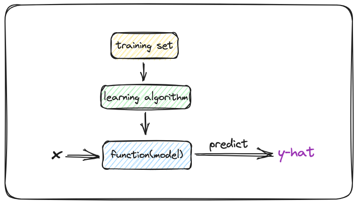

# Terminology
> Terminology: Words that can use to talk about machine learning concepts.

Training set: Data used to train the model.

Univariate linear regression: Linear regression with one variable.

Mutiple linear regression: Mutiple input features.

Cost function: tell us how well the is doing.

Squared error cost function(the most commonly used one for linear regression):
$$
J(w,b) = \displaystyle \frac{1}{2m}\sum^m_{i=1}(\hat{y}^{(i)} - y^{(i)})^2
$$
> $m$ = number of training examples

> Divide by $2m$ rather than $2$ just beacuse simplify our derivation later.

Gradient descent: a algorithm that used to find the minimized cost function J automatically. The most important algorithm in ML, applied in most models.

Batch gradient descent: "Batch" means each step of gradient descent uses all the training examples instead of subset of training data.

Convex function: a bowl-shaped function and cannot have any local minima other than the single global minimum.

## Notation
$x$ = input variable, feature

$y$ = output variable, target variable

$m$ = number of training examples

$(x,y)$ = single training examples

$(x^{(i)},y^{(i)})$ = $i^{th}$ training example

$\hat{y}$ = the prediction output $y$, it is a estimate

$f_{w,b} = wx + b$ = a function that takes x as input and depending on the value of w and b(parameters, coefficients or weights), f will out put some value of a prediction y-hat 

$f_{w,b} = w_1x_1 + w_2x_2 + ... +  w_nx_n + b = \vec{w} \cdot \vec{x} + b$

$\vec{x} = [x_1, x_2, x_3, ..., x_n]$ = a list of feature params