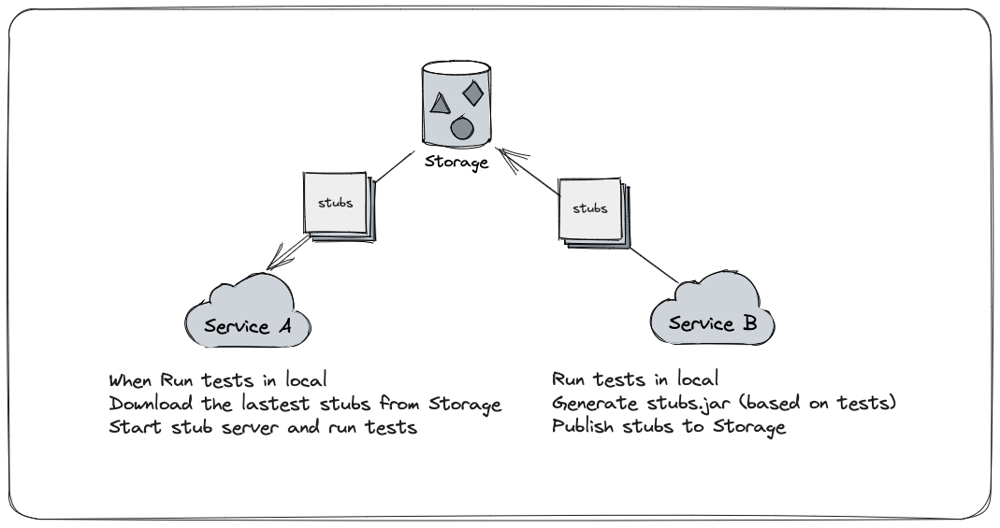

# Contract Testing in Spring

> Background: we have two services, Service A and Service B. We have a Maven Respository.

We assume that Service B provide contract for Service A.

When Service B run it Apis' Unit Tests, generating stub.jar base on the tests' return and publish to the Maven Repository(or other repository, whatever) by the way.

When Service A wants to run contract tests, it will download the lastest stub.jar and run this mock server in local env, call it and get the data, verify it.

This is the general process of contract testing : )

